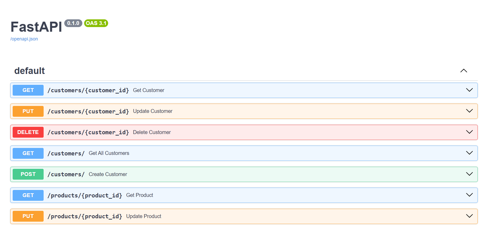
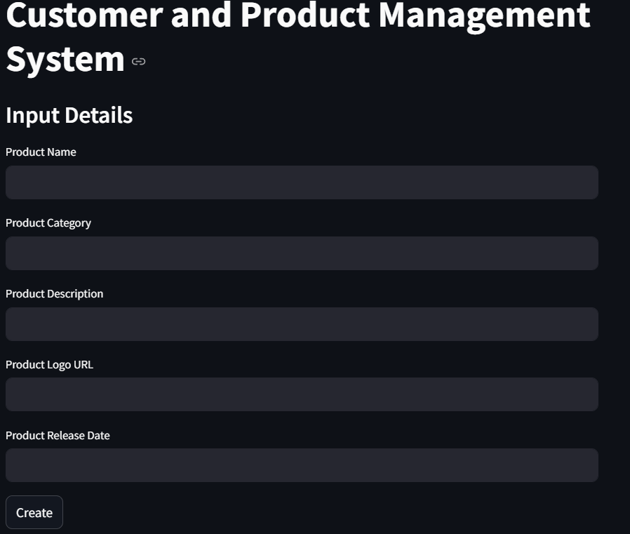
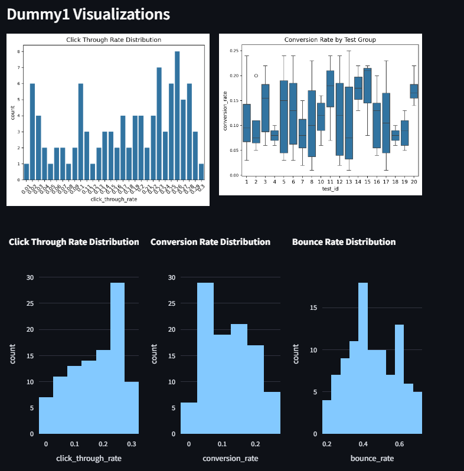

# A-B-testing-project
Group Project for DS 223

Group 1


# Dockerized ETL, PostgreSQL, and pgAdmin Setup


## Installation


Before getting started, ensure you have the following prerequisites installed:

Ensure Docker and Docker Compose are installed on your system.

- Docker: [Install Docker](https://docs.docker.com/get-docker/)
- Docker Compose: [Install Docker Compose](https://docs.docker.com/compose/install/)


1. Clone the repository:
   ```bash
   git clone https://github.com/Ramadiel/A-B-testing-project
   ```

2. Build and start the Docker containers:
   ```bash
   docker-compose up --build

## Access the Application

After running `docker-compose up --build`, you can access each component of the application at the following URLs:

- **Streamlit Frontend**: [http://localhost:8501](http://localhost:8501)  
  The main interface for managing employees, built with Streamlit. Use this create a user and a product and explore landing pages and statsictics.

- **FastAPI Backend**: [http://localhost:8008](http://localhost:8008)  
  The backend API where requests are processed. You can use tools like [Swagger UI](http://localhost:8008/docs)  to explore the API endpoints and their details.

- **PgAdmin** : [http://localhost:5050](http://localhost:5050)  
  A graphical tool for PostgreSQL, which allows you to view and manage the database. Login using the credentials set in the `.env` file:
   
  - **Email**: Value of `PGADMIN_EMAIL` in your `.env` file
  - **Password**: Value of `PGADMIN_PASSWORD` in your `.env` file

- **MKDOCS** : [http://127.0.0.1:8000/]
    Documentations for the project containing valuable information about the code and ext.
  

> Note: Ensure Docker is running, and all environment variables in `.env` are correctly configured before accessing these URLs.

## Documentation
Bellow are the steps to access the documentation

### Prerequisites
- `pip install mkdocs-material`
- `pip install 'mkdocstrings[python]'`

Type `mkdocs serve` and click on the browser connection to open it in your browser.


## Swagger API
Through Swagger you can explore the API endpoints and learn more about their details.


## UI and the main application
Using our streamlit UI, you can give us information about your product and our program will provide you with 3 possible landing pages. Plus, you will be able to get statistical analytics on the landing pages.


1. Fill in information about your product and click create.


2. Take a look at the landing pages, and the statistical analysis



